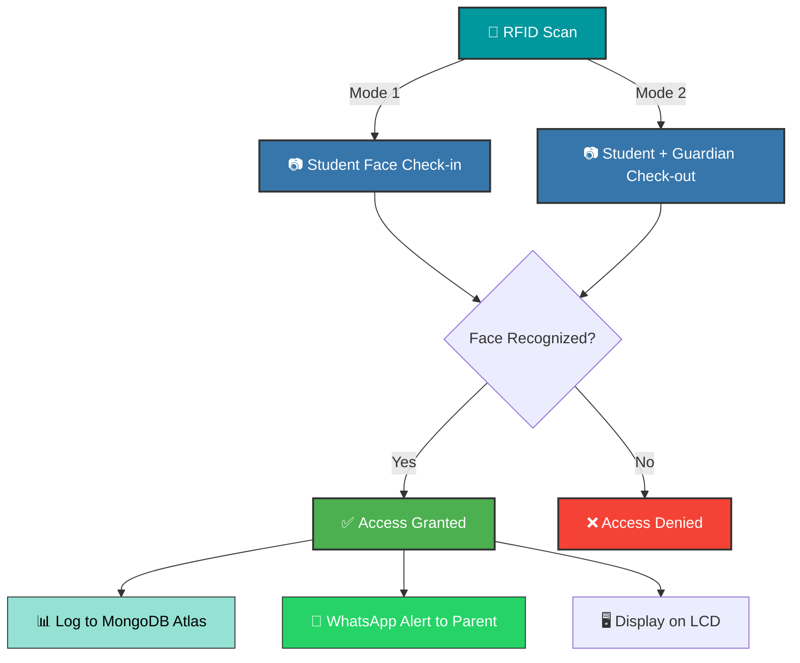

<div align="center">


# 🛡️ AI-Based Child Safety System

> **Intelligent RFID & Facial Recognition for Child Safety**


<br/>

An intelligent attendance and safety system that combines **RFID authorization**, **AI-powered facial recognition**, and **guardian verification** to ensure children's safety during check-in and check-out procedures. It keeps parents updated in real-time via WhatsApp and syncs logs securely to MongoDB Atlas.

</div>

<hr/>

## 📖 Detailed Project Overview

The **AI-Based Child Safety System** is a comprehensive solution designed to automate and secure the drop-off (check-in) and pick-up (check-out) processes for children at schools, daycare centers, or camps. By integrating hardware and AI-driven software components, the system creates a robust safety net that ensures only authorized individuals can drop off or pick up a child. 

### ✨ Core Features & Workflow

1. **🔒 Two-Factor Authentication (RFID + AI Facial Recognition)**
   - The process is initiated by a hardware trigger: scanning an authorized **RFID card** on an Arduino-connected reader.
   - Once a valid card is detected, the system activates the camera to perform high-accuracy **Facial Recognition** using OpenCV and dlib. It verifies the identity of the student and, during check-out, can also verify the authorized guardian.

2. **📥 Intelligent Check-in Mode**
   - The child's face is scanned upon arrival.
   - The system matches the face against a secure local database of enrolled students.
   - Upon successful recognition, the child is granted access, and attendance is marked instantly.

3. **📤 Secure Check-out Mode**
   - This mode is designed to verify both the student and the authorized guardian picking them up.
   - It ensures that a child cannot leave the premises with an unrecognized or unauthorized person, significantly mitigating the risk of unsafe handoffs.

4. **☁️ Automated Cloud Logging (MongoDB Atlas)**
   - All check-in and check-out events are logged in real-time directly to **MongoDB Atlas**.
   - This provides administrators with a live, centralized, and secure digital attendance register, eliminating manual paperwork.

5. **💬 Real-Time WhatsApp Notifications**
   - The moment a child successfully checks in or checks out, an automated WhatsApp message is instantly dispatched to the parents' registered mobile numbers using `pywhatkit`.
   - This provides parents with immediate peace of mind, knowing the exact status and location of their child.

6. **📟 Interactive Hardware Feedback**
   - The software communicates continuously with the Arduino to provide real-time status updates (e.g., "Check-in Active", "Access Granted", "Unauthorized Card") on a connected LCD screen, guiding the user through the process.

7. **🛡️ Data Security & Privacy**
   - Sensitive configurations, MongoDB credentials, and RFID IDs are strictly isolated using environment variables (`.env`), ensuring no sensitive data is ever hardcoded or exposed in the repository.

<hr/>

## 🚀 Quick Setup

### 1️⃣ Clone & Install Requirements
```bash
git clone https://github.com/somesh-opps/AI-Based-Child-Safety-System.git
cd AI-Based-Child-Safety-System

# Install core dependencies
pip install cmake dlib face-recognition
pip install -r requirements.txt
```

### 2️⃣ Hardware & Cloud Setup
- 🔌 **Arduino:** Upload the MFRC522 RFID sketch to your Arduino and connect it via USB.
- ☁️ **Cloud Database:** Create a **MongoDB Atlas** cluster, get your connection URI, and ensure your IP is whitelisted.
- 💬 **WhatsApp:** Make sure **WhatsApp Web** is logged in on your primary Chrome browser.

### 3️⃣ Configure Environment
```bash
cp .env.example .env
```
Open `.env` and fill in your details:
- **Arduino COM port**
- **Authorized RFID card IDs**
- **MongoDB Atlas URI**
- **Paths** to your `STUDENTS/` directory

### 4️⃣ Prepare Student Data
Create a folder structure for each student to hold their photos and their guardian's photos for recognition:
```text
STUDENTS/
├── Student_Name/
│   ├── photo1.jpg
│   ├── phone.txt (Parent's WhatsApp number)
│   └── guardian/
│       └── mother.jpg
```

### 5️⃣ Start the System
```bash
python -m hardware.main_rfid_control
```
> *🎉 Your safety system is now live! Simply scan an RFID card to begin the check-in or check-out process.*

<hr/>

## 🏗️ Project Architecture

```text
AI-Based-Child-Safety-System/
│
├── dashboard/
│   └── Frontend dashboard (Coming Soon)
│
├── backend/
│   └── Application logic, face recognition, MongoDB and services
│
├── hardware/
│   └── RFID, Arduino, Raspberry Pi and hardware integration
│
├── .env                 # Secrets and Configuration (NOT committed)
├── requirements.txt
└── .gitignore
```

- **MongoDB Atlas** is the application's primary database for logging attendance and events.
- **Hardware** logic is isolated from **Backend** business logic.

<hr/>

## ⚙️ How It Works

<div align="center">



</div>

<hr/>

## 📄 License

This project is licensed under the terms specified in the [LICENSE](LICENSE) file.

<br/>

<div align="center">
<b>Made with ❤️ for Child Safety</b>
</div>
