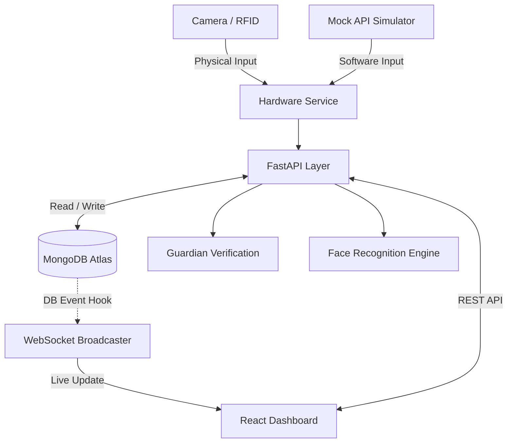

# 🛡️ AI-BASED CHILD SAFETY SYSTEM
> AI-powered child identification, attendance tracking, guardian verification and security monitoring platform.

This project is a comprehensive security system designed to protect children during drop-off and pickup times at educational institutions and daycares. 

It unifies **Artificial Intelligence (Facial Recognition)** and **Internet of Things (RFID)** with a modern **FastAPI / MongoDB** cloud backend to create a zero-trust model for child handovers. The system autonomously identifies students, records their attendance immutably, and strictly enforces guardian verification during check-out. Administrators monitor real-time operational telemetry through a live WebSocket-driven React dashboard.

---

## 📖 PROJECT OVERVIEW
Traditional attendance and pickup mechanisms rely heavily on manual human recognition, paper logs, or easily cloned RFID cards. This project solves these vulnerabilities by strictly identifying the *child* (via non-transferable biometrics) and explicitly validating the *guardian* picking them up.

By leveraging a centralized API architecture, the system prevents fragmented records, unauthorized pickups, and provides real-time awareness to facility administrators.

---

## 🎯 PROBLEM STATEMENT
* **Manual attendance** is slow, error-prone, and lacks an auditable chain of custody.
* **Child identification** using only ID cards is vulnerable to "buddy punching" or credential loss.
* **Secure pickup** is difficult to enforce when staff rely on memory to verify authorized guardians.
* **Fragmented records** between hardware logs and parent notification systems prevent real-time monitoring.

---

## 💡 PROPOSED SOLUTION
This project combines multiple modern technologies into a single, cohesive workflow:
`AI Computer Vision + RFID IoT + Guardian Verification + FastAPI + MongoDB Atlas + WebSockets + React Dashboard`

The system identifies a child via Face/RFID, processes the event in real-time through FastAPI, securely updates MongoDB, and broadcasts the event instantly to the administrative dashboard. 

---

## ✨ KEY FEATURES

### AI & Vision
* **Face recognition:** 128-d metric learning via the `face_recognition` library.
* **Face registration:** Deep-validated multi-part upload ensuring strictly one face per photo.
* **OpenCV integration:** Capable of processing webcam frames dynamically.

### Attendance
* **Check-in / Check-out:** Chronological telemetry logged securely.
* **Attendance history:** Queryable endpoints tracking historical presence.

### Security
* **Guardian verification:** Hard-gated mock verification step preventing unauthorized check-out.
* **Event tracking:** Immutable `system_events` logging for security exceptions.

### Backend & Database
* **FastAPI:** High-performance async REST APIs and WebSockets.
* **Authentication:** Secure JWT generation with bcrypt password hashing.
* **MongoDB Atlas:** Highly scalable cloud NoSQL persistence.

### Dashboard & Development
* **Student management:** Centralized creation of students and guardians.
* **Real-time updates:** WebSockets power a live event feed.
* **Mock hardware mode:** 100% software simulation for hardware-less development.

---

## 🏗️ SYSTEM ARCHITECTURE



---

## 🛠️ TECHNOLOGY STACK

| Technology | Purpose |
| ---------- | ------- |
| **Python 3.9+** | Core backend language and AI orchestrator. |
| **OpenCV (`cv2`)** | Capturing and processing vision frames. |
| **`face_recognition`** | AI biometrics and facial encodings. |
| **FastAPI** | High-performance asynchronous backend API. |
| **MongoDB Atlas** | Persistent NoSQL cloud database. |
| **React & TypeScript**| Manus-generated administrative dashboard frontend. |
| **WebSockets** | Real-time event telemetry to the dashboard. |
| **Arduino / MFRC522** | Hardware interface for physical RFID operations. |

---

## 🧠 HOW THE AI FACE RECOGNITION WORKS
The system uses the `face_recognition` library (wrapping `dlib`'s state-of-the-art C++ models).
1. **Camera/Image Acquisition:** Frames are captured via OpenCV (or uploaded via API).
2. **Face Detection:** The system isolates the bounding box of the face.
3. **Face Encoding:** The model projects the face into a 128-dimensional matrix.
4. **Comparison:** Euclidean distance is calculated against all registered student encodings (TOLERANCE = 0.6).
5. **Student Identification:** The closest match is resolved and returned to the business logic.

---

## 📝 REGISTRATION & ATTENDANCE WORKFLOW

### 1. Student Registration
`Student Info & Guardian Data` ➔ `Face Registration (Image Upload)` ➔ `Face Encoding` ➔ `MongoDB Storage`

### 2. Check-In Workflow
`Child Arrives` ➔ `Face / RFID Identification` ➔ `Duplicate Check` ➔ `Attendance Record Generated` ➔ `MongoDB Updated` ➔ `WebSocket Broadcast` ➔ `Dashboard Live Feed`

### 3. Check-Out & Guardian Verification
`Child Identified` ➔ `Guardian Verification Prompted` ➔ `Admin Verifies Guardian` ➔ `Authorization Granted` ➔ `Checkout Recorded`
*(If unauthorized, the checkout is blocked and a `GUARDIAN_VERIFICATION_FAILED` security event is logged).*

---

## 🔌 RFID + HARDWARE (Physical Mode)
When running with physical hardware, an Arduino microcontroller drives an MFRC522 RFID reader and a 16x2 I2C LCD. Python communicates via serial, issuing commands like `LCD:<MESSAGE>` and intercepting tags like `RFID:<CARD_ID>`.

---

## 💻 MOCK HARDWARE MODE (Software Simulation)
This project features a robust **Mock Hardware Mode**, enabling full-stack development without physical devices.

```env
HARDWARE_MODE=mock
```
* **Why it exists:** Allows CI/CD, cloud deployment, and software iteration without Arduino/Webcam dependencies.
* **How it works:** Real hardware calls (`cv2.VideoCapture` and PySerial) are elegantly bypassed. Instead, the `Demo & Simulation` panel in the dashboard hits `/api/system/mock/face/{id}` to inject synthetic but deterministic telemetry into the backend.

---

## 🌐 API REFERENCE

| Method | Endpoint | Purpose |
| ------ | -------- | ------- |
| `POST` | `/api/auth/login` | Admin login |
| `POST` | `/api/auth/logout` | Logout |
| `GET`  | `/api/auth/me` | Current session |
| `GET`  | `/api/students` | List students |
| `POST` | `/api/students` | Create student |
| `POST` | `/api/students/register-with-face`| Create student with biometrics |
| `GET`  | `/api/attendance` | Attendance records |
| `GET`  | `/api/dashboard/summary` | Dashboard statistics |
| `POST` | `/api/system/checkin/start` | Start check-in mode |
| `POST` | `/api/system/checkin/stop` | Stop check-in mode |
| `POST` | `/api/system/checkout/start`| Start checkout mode |
| `POST` | `/api/system/mock/face/{id}`| Simulate face recognition |
| `POST` | `/api/system/mock/rfid/{id}`| Simulate RFID scan |
| `WS`   | `/ws/events` | Real-time events |

---

## 🗄️ MONGODB DATABASE
**Database:** `childdatadb`
* **`students`**: Core demographic profiles and biometrics status.
* **`guardians`**: N:1 relational mapping to students for pickup authorization.
* **`attendance`**: Telemetry log of check-in and check-out events.
* **`system_events`**: Immutable audit logs of hardware toggles and security exceptions.
* **`admins`**: Secure JWT credentials.

---

## 🖥️ DASHBOARD & REAL-TIME EVENTS
The React dashboard acts as the administrative command center. It communicates strictly with FastAPI, never accessing MongoDB directly. 

**WebSocket Architecture:**
`Database Update` ➔ `Event Creation` ➔ `WebSocket Broadcast` ➔ `Dashboard`
The database abstraction explicitly guarantees that a WebSocket event is *only* fired if the MongoDB insertion strictly succeeds, ensuring 100% data consistency.

---

## 📁 PROJECT DIRECTORY
```text
AI-Based-Child-Safety-System/
├── backend/
│   ├── api/
│   │   ├── routes/
│   │   ├── services/
│   │   ├── dependencies.py
│   │   └── main.py
│   ├── checkin.py
│   ├── checkout.py
│   └── database.py
├── dashboard/
│   └── client/
├── hardware/
├── STUDENTS/
├── .env.example
├── requirements.txt
├── run_backend.sh
└── run_dashboard.sh
```

---

## ⚙️ INSTALLATION & SETUP

### 1. Clone the Repository
```bash
git clone https://github.com/somesh-opps/AI-Based-Child-Safety-System.git
cd AI-Based-Child-Safety-System
```

### 2. Python Environment & Backend
```bash
python3 -m venv .venv
source .venv/bin/activate
pip install -r requirements.txt
```

### 3. Create First Admin
```bash
python3 create_admin.py admin admin
```

### 4. Run the Backend
```bash
./run_backend.sh
```
*(Runs FastAPI on `http://localhost:8000`)*

### 5. Run the Dashboard
```bash
cd dashboard/client
npm install
npm run dev
```

---

## 🧪 SOFTWARE-ONLY DEMO PROCEDURE
1. Start backend in `HARDWARE_MODE=mock`.
2. Start the dashboard and log in with `admin`.
3. Go to **Students** and create a test student (e.g., `STU-TEST`).
4. Click **Demo & Simulation** in the sidebar.
5. In the Command Center, click **Start Mode** for Check-in.
6. In the Demo view, simulate a Face Recognition for `STU-TEST`.
7. Watch the Live Feed instantly update via WebSockets.
8. Stop Check-in, Start Check-out, and simulate Guardian Verification.

---

## 🔒 SECURITY
* **Authentication:** JWT (JSON Web Tokens) with `bcrypt` password hashing.
* **Environment Variables:** Credentials like `MONGODB_URI` and `JWT_SECRET` are strictly kept in `.env` and never committed.
* **Duplicate Protection:** Consecutive attendance events for the same student on the same day are aggressively rejected by the backend to prevent data pollution.

---

## 🚦 CURRENT STATUS

| Feature                   | Status |
| ------------------------- | ------ |
| FastAPI backend           | ✅ |
| Manus dashboard           | ✅ |
| MongoDB Atlas             | ✅ |
| Face Recognition          | ✅ |
| WebSockets                | ✅ |
| Mock Hardware             | ✅ |
| Guardian Verification     | 🟡 |
| RFID                      | 🟡 |
| Physical Hardware Testing | 🔵 |
| Raspberry Pi Deployment   | 🔵 |

*Legend: ✅ Implemented | 🟡 Partially Implemented / Mocked | 🔵 Future / Planned*

---

## 🚀 FUTURE SCOPE
* **Raspberry Pi Deployment:** Migrate Python services onto physical edge hardware.
* **Face Liveness Detection:** Implement IR/Depth sensing to prevent photograph spoofing.
* **Push Notifications:** Integrate FCM or Twilio for mobile guardian alerts.
* **Offline Edge Operation:** Local SQLite sync to ensure operation during network outages.

---

## 📝 PRIVACY NOTE
This system processes sensitive biometric and demographic information of children. It is engineered with security best practices, but organizations must deploy it in compliance with their local data protection regulations (e.g., GDPR, COPPA). Avoid exposing the API or database to the public internet without strict firewall rules.

---

## 👨‍💻 AUTHOR
**Somesh Kumar Sahoo**  
GitHub: [somesh-opps](https://github.com/somesh-opps)
